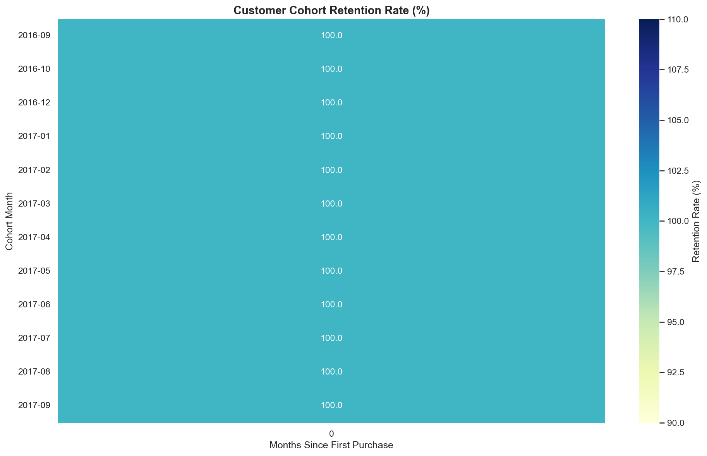

# Analysis Results — Olist E-commerce

Tổng hợp insights từ phân tích ~100,000 đơn hàng thương mại điện tử Olist (Brazil) giai đoạn 2016–2018.

---

## 1. RFM Customer Segmentation

### Phân khúc khách hàng

| Segment | Đặc điểm | Chiến lược |
|---|---|---|
| **Champions** | Mua gần đây, thường xuyên, giá trị cao | Reward, upsell |
| **Loyal Customers** | Mua đều đặn, gắn bó lâu dài | Loyalty program |
| **New Customers** | Mới mua lần đầu | Onboarding, nurture |
| **Potential** | Có tiềm năng nhưng chưa convert | Targeted campaigns |
| **At Risk** | Từng mua nhiều nhưng đang rời đi | Win-back campaigns |
| **Lost** | Không mua trong thời gian dài | Re-engagement hoặc bỏ qua |

### Key Insights
- Phần lớn khách hàng thuộc nhóm **New Customers** — cho thấy Olist đang tăng trưởng mạnh về acquisition nhưng cần cải thiện retention
- Nhóm **Champions** tuy ít về số lượng nhưng đóng góp tỷ lệ revenue không cân xứng — cần được chăm sóc đặc biệt
- Tỷ lệ khách hàng **Lost** cao → vấn đề retention cần được ưu tiên giải quyết

---

## 2. Delivery Performance by State

### Key Insights
- Các bang ở vùng **Bắc và Đông Bắc Brazil** (RR, AP, AM) có thời gian giao hàng dài nhất — do địa lý xa xôi và hạ tầng logistics kém phát triển
- Khu vực **São Paulo (SP)** và các bang miền Nam có delivery time tốt nhất — tập trung nhiều seller và warehouse
- Late delivery rate có tương quan rõ với delivery time: bang xa = tỷ lệ giao trễ cao hơn

---

## 3. Review Score vs Delivery Time

### Key Insights
- Delivery time có **tương quan nghịch rõ ràng** với review score
- Đơn giao trong **≤7 ngày**: review score cao nhất (~4.3+)
- Đơn giao **>21 ngày**: review score giảm đáng kể (~2.5–3.0)
- **Implication cho business:** Cải thiện delivery time là đòn bẩy trực tiếp để tăng customer satisfaction

---

## 4. Monthly Revenue Trend

### Key Insights
- Revenue tăng trưởng ổn định từ **2016 đến 2018**
- Đỉnh điểm vào **tháng 11** — trùng với mùa mua sắm cuối năm và Black Friday Brazil
- Tháng 9/2018 có sự sụt giảm đột ngột — khả năng do dataset bị cắt, không phản ánh thực tế kinh doanh

---

## 5. Top Product Categories

### Key Insights
- **Health & Beauty**, **Watches & Gifts**, **Bed/Bath/Table** là top 3 category về revenue
- **Health & Beauty** dẫn đầu cả về revenue lẫn order count → category chiến lược của Olist
- Một số category có average order value cao dù order count không nhiều → sản phẩm giá trị cao như Electronics, Furniture

---

## 6. Cohort Retention Analysis

### Key Insights
- **Retention rate sau tháng đầu tiên rất thấp** (~2–5%) — đây là vấn đề nghiêm trọng
- Hầu hết khách hàng chỉ mua **1 lần duy nhất** và không quay lại
- Điều này phù hợp với phân tích RFM: phần lớn customer là "New Customers" hoặc "Lost"
- **Recommendation:** Olist cần đầu tư mạnh vào retention strategy — email marketing, loyalty program, personalized recommendations

---

## Tổng kết — Business Recommendations

### Vấn đề 1: Retention thấp
- Chỉ ~2-5% khách hàng quay lại sau tháng đầu
- **Giải pháp:** Xây dựng loyalty program, email follow-up sau mua hàng, personalized offer

### Vấn đề 2: Delivery chậm ở vùng xa
- Các bang phía Bắc có delivery time gấp đôi so với São Paulo
- **Giải pháp:** Mở rộng warehouse network, ưu tiên partnership với carrier địa phương

### Vấn đề 3: Review score giảm theo delivery time
- Mỗi tuần giao hàng thêm → review score giảm đáng kể
- **Giải pháp:** SLA rõ ràng cho từng vùng, thông báo proactive khi có delay

### Cơ hội: Champions segment
- Nhóm Champions đóng góp revenue không cân xứng với số lượng
- **Giải pháp:** VIP program, early access, exclusive offers để giữ chân nhóm này

---

*Analysis performed on Olist Brazilian E-Commerce dataset (2016–2018)*
*Pipeline: PostgreSQL + dbt → Python + matplotlib/seaborn*
