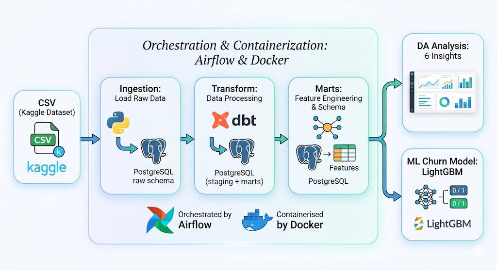

# E-commerce Analytics Pipeline

End-to-end data pipeline xây dựng trên dataset thương mại điện tử **Olist (Brazil)**, bao gồm data ingestion, transformation (dbt), data quality testing, orchestration (Airflow), phân tích DA và mô hình ML dự đoán churn.

---

## Kiến trúc tổng quan



> **Chi tiết:** CSV (Kaggle) → Ingestion (Python → PostgreSQL raw) → Transform (dbt staging + marts) → Star Schema + ML Features → DA Analysis (6 insights) + ML Churn (LightGBM)  
> Toàn bộ được orchestrate bởi **Airflow** và containerise bởi **Docker**.

**Xem sơ đồ chi tiết:** [docs/ARCHITECTURE.md](docs/ARCHITECTURE.md)
---

## Stack công nghệ

| Layer | Công nghệ | Phiên bản |
|---|---|---|
| Data Source | CSV — Olist Kaggle Dataset | 9 bảng, ~650K rows |
| Ingestion | Python, pandas, SQLAlchemy | Python 3.12 |
| Storage | PostgreSQL | 15 |
| Transform | dbt Core | 1.11 |
| Orchestration | Apache Airflow | 2.9.0 |
| Infrastructure | Docker, Docker Compose | — |
| Analysis | pandas, matplotlib, seaborn | — |
| Machine Learning | LightGBM, scikit-learn, SHAP | — |

---

## Cấu trúc thư mục

```
E-commerce-Analytics-Pipeline/
│
├── docker-compose.yml             # Định nghĩa services (PostgreSQL, Airflow)
├── Dockerfile                     # Custom Airflow image (dbt + psycopg2)
├── init_schemas.sql               # Tạo schema raw/staging/marts
├── init_airflow_db.sql            # Tạo database Airflow
├── .env.sample                    # Mẫu biến môi trường
├── requirements.txt               # Python dependencies
│
├── docs/                          # 📄 Tài liệu chi tiết
│   ├── ARCHITECTURE.md            # Kiến trúc hệ thống + sơ đồ luồng
│   ├── DATA_MODEL.md              # Star Schema + dbt lineage
│   ├── ANALYTICS.md               # Kết quả phân tích DA (6 analyses)
│   └── ML_CHURN.md                # ML Churn Prediction
│
├── Data/raw/                      # 9 CSV gốc từ Kaggle
│
├── ingestion/                     # ⬇️ Data ingestion
│   ├── load_raw.py                # Load CSV → PostgreSQL raw schema
│   └── validate.py                # Kiểm tra data quality
│
├── ecommerce_pipeline/            # 🔄 dbt project
│   ├── dbt_project.yml
│   ├── profiles.yml
│   ├── macros/                    # generate_schema_name, get_ref_date
│   ├── models/
│   │   ├── staging/               # 6 views — chuẩn hoá tên, cast type
│   │   └── marts/                 # 6 tables — star schema + ML features
│   └── tests/
│
├── airflow/dags/                  # ⏰ Airflow DAG
│   └── ecommerce_pipeline_dag.py  # 3 tasks: ingest → dbt run → dbt test
│
├── notebooks/                     # 📊 Phân tích & ML
│   ├── edaData.py                 # EDA ban đầu
│   ├── customer_analysis.py       # 6 phân tích DA
│   ├── Churn_prediction.py        # ML churn prediction + scoring
│   └── results/                   # Output charts (10 PNG files)
│
├── ml/models/                     # 🤖 Trained models
│   └── churn_model.pkl            # LightGBM churn model
│
└── logs/                          # dbt logs
```

---

## Hướng dẫn chạy

### Yêu cầu
- Docker Desktop (đang chạy)
- Python 3.11+

### 1. Clone repo

```bash
git clone https://github.com/<your-username>/E-commerce-Analytics-Pipeline.git
cd E-commerce-Analytics-Pipeline
pip install -r requirements.txt
```

### 2. Tạo file `.env`

Tạo file `.env` ở thư mục gốc (dùng VS Code hoặc PyCharm — tránh PowerShell vì sinh UTF-8 BOM):

```
POSTGRES_USER=de_admin
POSTGRES_PASSWORD=de_password_local
POSTGRES_DB=ecommerce_db
```

### 3. Download dataset

Tải [Olist Brazilian E-Commerce](https://www.kaggle.com/datasets/olistbr/brazilian-ecommerce) từ Kaggle và giải nén vào `Data/raw/`. Cần có đủ 9 file CSV.

### 4. Khởi động hệ thống

```bash
docker-compose up -d
```

Lần đầu mất 3–5 phút. Kiểm tra:
```bash
docker-compose ps
# Mong đợi: postgres (healthy), airflow-webserver (healthy), airflow-scheduler (up)
```

### 5. Chạy pipeline

Mở Airflow UI tại [http://localhost:8080](http://localhost:8080) (admin/admin):
- Bật toggle DAG `ecommerce_pipeline`
- Bấm **▶ Trigger DAG** để chạy thủ công

Hoặc chờ schedule tự động chạy lúc 6:00 AM UTC mỗi ngày.

### 6. Verify kết quả

```bash
docker exec -it de_postgres psql -U de_admin -d ecommerce_db -c "\dt marts.*"
docker exec -it de_postgres psql -U de_admin -d ecommerce_db -c "SELECT COUNT(*) FROM marts.fct_orders;"
```

### 7. Chạy phân tích (optional)

```bash
# DA Analysis — 6 charts
python notebooks/customer_analysis.py

# ML Churn Prediction — train + score
python notebooks/Churn_prediction.py
```

---

## Data Model

Hệ thống sử dụng **Star Schema** trong marts layer:

```
                 dim_date (TODO)
                     │
dim_customers ── fct_orders ── dim_products
                     │
                dim_sellers
```

Mở rộng cho ML:

```
fct_orders + dim_customers → mart_customer_features (16 features)
fct_orders                 → mart_churn_labels      (churn label)
```

**Xem chi tiết:** [docs/DATA_MODEL.md](docs/DATA_MODEL.md)

---

## Airflow DAG

**DAG ID:** `ecommerce_pipeline`
**Schedule:** `0 6 * * *` (6:00 AM UTC hàng ngày)

```
ingest_raw_data ──→ dbt_run ──→ dbt_test
  PythonOperator   BashOperator  BashOperator
```

---

## Kết quả phân tích

### Data Analysis — 6 phân tích
| # | Phân tích | Insight chính |
|---|---|---|
| 1 | RFM Segmentation | Phần lớn KH dừng ở nhóm New/Potential |
| 2 | Delivery by State | Vùng Bắc/Đông Bắc giao hàng >20 ngày |
| 3 | Review vs Delivery | Delivery >21 ngày → review < 3.0 |
| 4 | Monthly Revenue | Black Friday 11/2017 = đỉnh doanh thu |
| 5 | Top Categories | Health & Beauty dẫn đầu |
| 6 | Repeat Purchase | **97% KH chỉ mua 1 lần** |

**Xem chi tiết:** [docs/ANALYTICS.md](docs/ANALYTICS.md)

### Machine Learning — Churn Prediction
| Chỉ số | Giá trị |
|---|---|
| Model | LightGBM (class_weight={0:5, 1:1}) |
| ROC-AUC | 0.738 |
| Customers scored | 96,478 |
| Output | `marts.churn_scores` — risk segment + recommended action |

**Xem chi tiết:** [docs/ML_CHURN.md](docs/ML_CHURN.md)

---

## Workflow hàng ngày

```bash
# Mở máy → Docker Desktop → chạy:
docker-compose start

# Xong việc:
docker-compose stop
```

---

## Tài liệu

| Tài liệu | Nội dung |
|---|---|
| [docs/ARCHITECTURE.md](docs/ARCHITECTURE.md) | Kiến trúc hệ thống, sơ đồ luồng, stack, cấu trúc thư mục |
| [docs/DATA_MODEL.md](docs/DATA_MODEL.md) | Star Schema, staging/marts models, dbt lineage, data quality |
| [docs/ANALYTICS.md](docs/ANALYTICS.md) | 6 phân tích DA + insights chiến lược |
| [docs/ML_CHURN.md](docs/ML_CHURN.md) | ML churn prediction — model, features, evaluation |

---

## Tài liệu tham khảo

- [dbt Documentation](https://docs.getdbt.com)
- [Apache Airflow Documentation](https://airflow.apache.org/docs)
- [Fundamentals of Data Engineering — Reis & Housley](https://www.oreilly.com/library/view/fundamentals-of-data/9781098108298/)
- [Olist Brazilian E-Commerce Dataset — Kaggle](https://www.kaggle.com/datasets/olistbr/brazilian-ecommerce)
