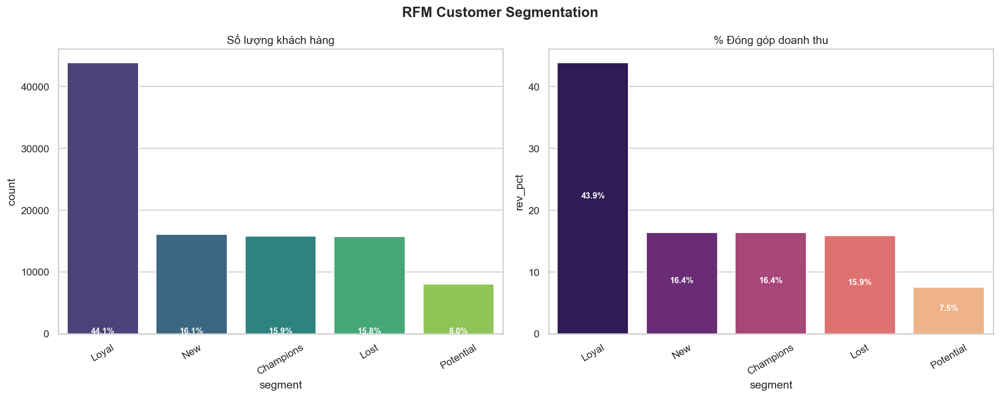
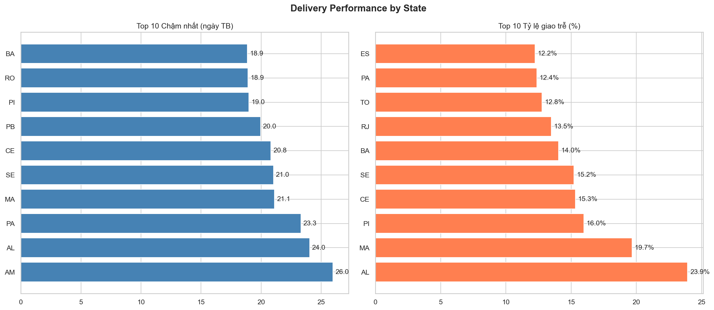
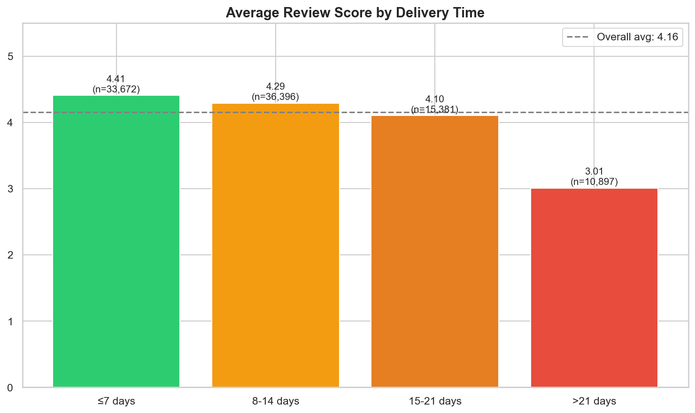
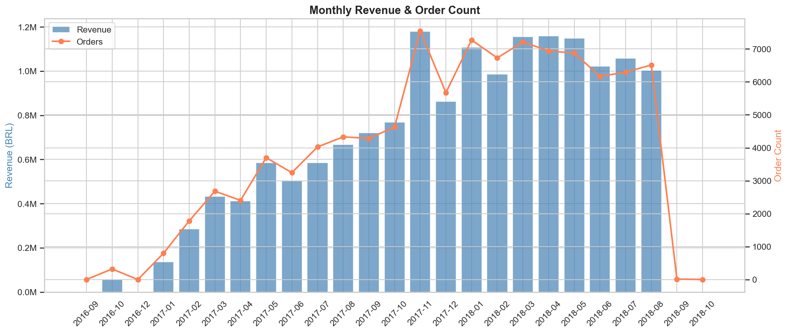
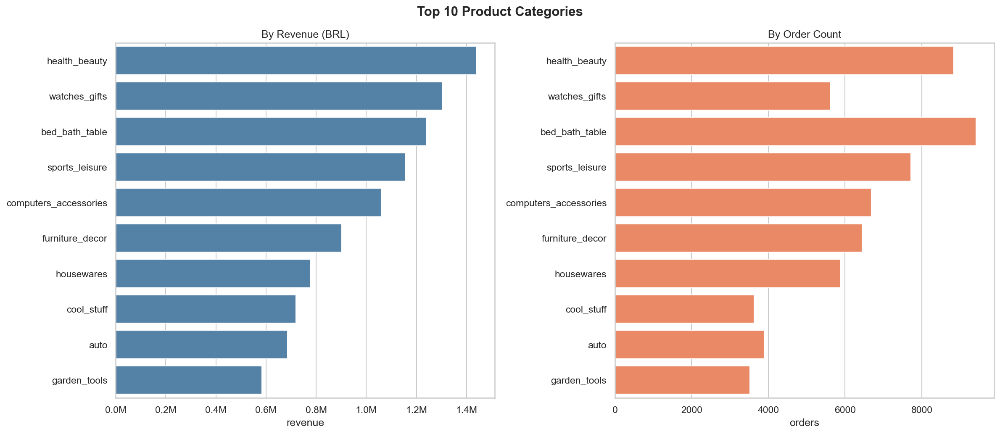
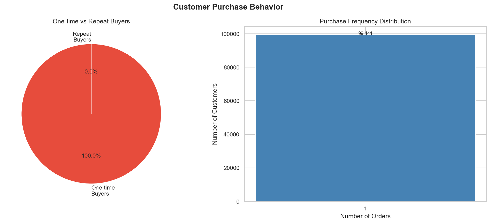

# Phân tích dữ liệu — Olist E-commerce (Brazil)

Tổng hợp insights chiến lược từ phân tích ~100,000 đơn hàng trên nền tảng Olist giai đoạn 2016–2018.

---

## Mối liên hệ với Data Pipeline

```
[DE Pipeline] → marts.fct_orders, dim_customers, dim_products, dim_sellers
                        │
                        ▼
              [DA Analysis — phần này]
                        │
                        ├── Customer Analysis (RFM + Repeat Purchase)
                        ├── Delivery & Operations Analysis
                        └── Revenue & Product Analysis
```

Phần phân tích này **không truy cập raw data** — chỉ query từ marts layer đã được transform và tested bởi DE pipeline.

---

## Danh sách phân tích

| # | Phân tích | Mục đích | Output |
|---|---|---|---|
| 1 | RFM Segmentation | Phân khúc khách hàng theo hành vi | `01_rfm_segments.png` |
| 2 | Delivery by State | Đánh giá hiệu suất giao hàng theo vùng | `02_delivery_by_state.png` |
| 3 | Review vs Delivery | Mối quan hệ giữa tốc độ giao và đánh giá | `03_review_vs_delivery.png` |
| 4 | Monthly Revenue | Xu hướng doanh thu theo thời gian | `04_monthly_revenue.png` |
| 5 | Top Categories | Ngành hàng doanh thu cao nhất | `05_top_categories.png` |
| 6 | Repeat Purchase | Tỷ lệ mua lại — thách thức retention | `06_repeat_purchase.png` |

**File script:** `notebooks/customer_analysis.py`
**Kết quả chart:** `notebooks/results/`

---

## 1. RFM Customer Segmentation



### Phương pháp
- **Recency:** Số ngày từ lần mua cuối đến ngày tham chiếu
- **Frequency:** Số đơn hàng đã đặt
- **Monetary:** Tổng giá trị mua hàng

Mỗi chỉ số được chia thành 5 quintile (1→5), sau đó gán segment dựa trên tổ hợp R-F:

### Phân khúc khách hàng

| Segment | Đặc điểm | Chiến lược đề xuất |
|---|---|---|
| **Champions** | Mua gần đây, tần suất cao, chi tiêu lớn | Đặc quyền VIP, tri ân khách hàng thân thiết |
| **Loyal** | Khách hàng trung thành, mua đều đặn | Chương trình tích điểm, ưu tiên trải nghiệm |
| **New** | Khách hàng mới phát sinh giao dịch | Quy trình Onboarding, coupon cho đơn thứ 2 |
| **Potential** | Khách hàng tiềm năng, cần thúc đẩy | Gợi ý sản phẩm liên quan (Cross-sell) |
| **At Risk** | Khách hàng cũ có dấu hiệu rời bỏ | Win-back campaign, giảm giá sâu để kéo lại |
| **Lost** | Đã ngừng tương tác rất lâu | Tối ưu chi phí, chỉ re-marketing vào dịp lớn |

### Key Insights
* **Acquisition vs Retention:** Phần lớn khách hàng dừng lại ở nhóm **New** hoặc **Potential**. Olist đang làm rất tốt việc thu hút khách hàng mới nhưng cực kỳ yếu trong việc giữ chân họ.
* **Sức mạnh nhóm tinh hoa:** Nhóm **Champions** chiếm tỷ trọng nhỏ về số lượng nhưng đóng góp giá trị đơn hàng trung bình (AOV) cao nhất.
* **Cảnh báo:** Tỷ lệ khách hàng chuyển dịch sang nhóm **At Risk** và **Lost** tăng nhanh theo thời gian.

---

## 2. Delivery Performance by State



### Key Insights
* **Phân hóa địa lý:** Các bang vùng **Bắc và Đông Bắc** (RR, AP, AM) có thời gian giao hàng dài nhất (trung bình >20 ngày) do hạ tầng logistics gặp trở ngại địa lý.
* **Trung tâm Logistics:** Khu vực **São Paulo (SP)** và miền Nam có tốc độ giao hàng nhanh vượt trội nhờ tập trung mật độ seller và kho bãi cao.
* **Tỷ lệ trễ hạn:** Có sự tương quan thuận giữa khoảng cách địa lý và tỷ lệ đơn hàng bị trễ (Late Delivery).

---

## 3. Review Score vs Delivery Time



### Key Insights
* **Ngưỡng kiên nhẫn:** Review score giữ mức cao (~4.2+) nếu hàng đến trong **≤7 ngày**.
* **Điểm rơi hài lòng:** Khi thời gian giao hàng vượt quá **21 ngày**, điểm đánh giá sụt giảm nghiêm trọng xuống dưới 3.0.
* **Kết luận:** Tốc độ giao hàng là yếu tố tiên quyết ảnh hưởng đến uy tín của sàn và khả năng quay lại của khách hàng.

---

## 4. Monthly Revenue Trend



### Key Insights
* **Đà tăng trưởng:** Doanh thu tăng trưởng phi mã từ cuối 2017 đến giữa 2018.
* **Điểm bùng nổ:** **Tháng 11/2017** ghi nhận doanh thu kỷ lục nhờ sự kiện **Black Friday**.
* **Lưu ý dữ liệu:** Sự sụt giảm ở tháng cuối cùng là do tập dữ liệu bị cắt ngang (Data Cutoff), không phải do kinh doanh sa sút.

---

## 5. Top Product Categories



### Key Insights
* **Ngành hàng chủ lực:** **Health & Beauty** (Sức khỏe & Sắc đẹp) là "con gà đẻ trứng vàng" khi dẫn đầu cả về doanh thu lẫn số lượng đơn hàng.
* **Giá trị cao:** **Watches & Gifts** có số đơn hàng ít hơn nhưng doanh thu rất lớn, cho thấy AOV của ngành hàng này rất cao.
* **Thiết yếu:** Các nhóm ngành Home Decor (Bed/Bath/Table) duy trì sức mua ổn định xuyên suốt.

---

## 6. Repeat Purchase Behavior (The Retention Challenge)



### Key Insights
* **Thực trạng báo động:** **~97% khách hàng chỉ mua 1 lần duy nhất.** Đây là vấn đề cốt lõi của mô hình Olist trong giai đoạn này.
* **Tỷ lệ quay lại:** Chỉ có khoảng **3%** khách hàng phát sinh đơn hàng thứ 2 trở đi.
* **Giải thích phương pháp:** Thay vì dùng Cohort Heatmap (vốn sẽ bị trống sau tháng 12), biểu đồ Repeat Purchase phản ánh trực diện sự đứt gãy trong vòng đời khách hàng.

---

## Tổng kết & Kiến nghị chiến lược

1. **Chiến lược Retention (Ưu tiên số 1):** Triển khai hệ thống CRM và Email Marketing tự động để chăm sóc khách hàng sau mua. Cần tập trung chuyển đổi nhóm "New" thành "Loyal".
2. **Tối ưu Logistics vùng xa:** Cân nhắc thiết lập các trạm trung chuyển (Hub) tại khu vực Đông Bắc để giảm thời gian giao hàng và cứu vãn Review Score.
3. **Khai thác nhóm Champions:** Tạo chương trình khách hàng thân thiết (Loyalty Program) dành riêng cho nhóm 3% khách hàng quay lại để biến họ thành đại sứ thương hiệu.
4. **Triển khai phân tích sâu hơn bằng ML:** Xây dựng mô hình dự đoán churn để chủ động can thiệp trước khi khách hàng rời đi → xem [ML_CHURN.md](./ML_CHURN.md).

---

## Hướng dẫn chạy

### Yêu cầu
- DE Pipeline đang chạy (Docker Compose up)
- Python 3.11+ với các dependencies: `pandas`, `matplotlib`, `seaborn`, `sqlalchemy`, `python-dotenv`

### Thực thi

```bash
# Đảm bảo Docker đang chạy
docker-compose start

# Chạy toàn bộ analysis
python notebooks/customer_analysis.py
```

Kết quả được lưu vào `notebooks/results/`.

### Stack

| Tool | Mục đích |
|---|---|
| Python + pandas | Data manipulation |
| matplotlib + seaborn | Visualization |
| SQLAlchemy | Kết nối PostgreSQL |
| PostgreSQL (marts layer) | Data source |

---

*Phân tích thực hiện trên tập dữ liệu Olist Brazilian E-Commerce (2016–2018)*
