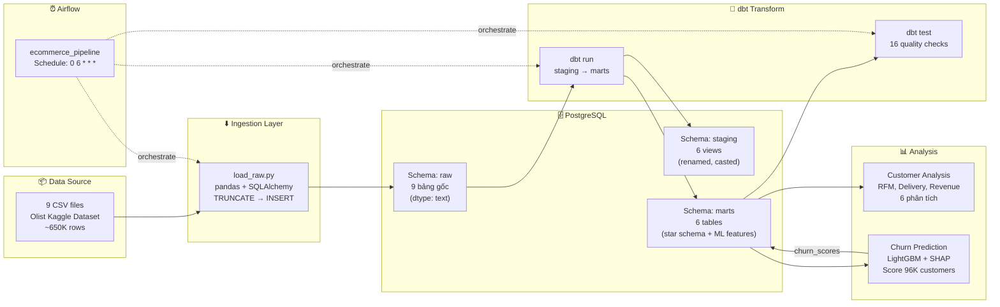

# Kiến trúc hệ thống — E-commerce Analytics Pipeline

## Tổng quan

Hệ thống xây dựng một **data pipeline end-to-end** trên dataset thương mại điện tử Olist (Brazil), bao gồm 5 tầng chính:

```
┌──────────────────────────────────────────────────────────────────────┐
│                        E-commerce Analytics Pipeline                │
├──────────────────────────────────────────────────────────────────────┤
│                                                                      │
│   ┌─────────┐     ┌──────────┐     ┌──────────┐     ┌───────────┐  │
│   │  Source  │────▶│ Ingestion│────▶│Transform │────▶│  Serving  │  │
│   │ (CSV)   │     │ (Python) │     │  (dbt)   │     │  (Marts)  │  │
│   └─────────┘     └──────────┘     └──────────┘     └─────┬─────┘  │
│                                                            │        │
│                         ┌──────────────────────────────────┤        │
│                         │                                  │        │
│                   ┌─────▼─────┐                    ┌───────▼──────┐ │
│                   │    DA     │                    │     ML       │ │
│                   │ Analysis  │                    │  Churn Model │ │
│                   └───────────┘                    └──────────────┘ │
│                                                                      │
│   ┌──────────────────────────────────────────────────────────────┐  │
│   │              Orchestration — Apache Airflow                   │  │
│   └──────────────────────────────────────────────────────────────┘  │
│   ┌──────────────────────────────────────────────────────────────┐  │
│   │              Infrastructure — Docker Compose                  │  │
│   └──────────────────────────────────────────────────────────────┘  │
└──────────────────────────────────────────────────────────────────────┘
```

---

## Luồng dữ liệu chi tiết



---

## Stack công nghệ

| Layer | Công nghệ | Phiên bản | Vai trò |
|---|---|---|---|
| **Data Source** | CSV (Kaggle) | — | 9 bảng dữ liệu Olist Brazil E-commerce |
| **Ingestion** | Python, pandas, SQLAlchemy | Python 3.12 | Đọc CSV, load vào PostgreSQL schema `raw` |
| **Storage** | PostgreSQL | 15 | Data warehouse (raw → staging → marts) |
| **Transform** | dbt Core | 1.11 | Staging views + mart tables + data quality tests |
| **Orchestration** | Apache Airflow | 2.9.0 | Schedule DAG chạy pipeline hàng ngày |
| **Infrastructure** | Docker, Docker Compose | — | Container hoá toàn bộ hệ thống |
| **Analysis** | pandas, matplotlib, seaborn | — | DA: RFM, Delivery, Revenue analysis |
| **Machine Learning** | LightGBM, scikit-learn, SHAP | — | Churn prediction + feature importance |

---

## Chi tiết từng layer

### 1. Source Layer — CSV Files

**Nguồn:** [Olist Brazilian E-Commerce — Kaggle](https://www.kaggle.com/datasets/olistbr/brazilian-ecommerce)

9 file CSV, tổng cộng ~650,000 rows, thời gian 2016–2018:

| File | Bảng đích | Rows | Granularity |
|---|---|---|---|
| `olist_orders_dataset.csv` | `raw.orders` | 99,441 | 1 đơn hàng |
| `olist_order_items_dataset.csv` | `raw.order_items` | 112,650 | 1 sản phẩm trong 1 đơn |
| `olist_order_payments_dataset.csv` | `raw.order_payments` | 103,886 | 1 lần thanh toán |
| `olist_order_reviews_dataset.csv` | `raw.order_reviews` | 99,224 | 1 đánh giá |
| `olist_customers_dataset.csv` | `raw.customers` | 99,441 | 1 tài khoản khách hàng |
| `olist_products_dataset.csv` | `raw.products` | 32,951 | 1 sản phẩm |
| `olist_sellers_dataset.csv` | `raw.sellers` | 3,095 | 1 seller |
| `olist_geolocation_dataset.csv` | `raw.geolocation` | 1,000,163 | 1 toạ độ zip code |
| `product_category_name_translation.csv` | `raw.product_category_translation` | 71 | 1 tên category (PT→EN) |

### 2. Ingestion Layer — Python Script

**File:** `ingestion/load_raw.py`

Quy trình:
1. Đọc CSV bằng `pandas` (tất cả cột đọc dưới dạng `dtype=str` để tránh mất dữ liệu)
2. Kiểm tra bảng đích có tồn tại không → nếu có thì `TRUNCATE` trước
3. Insert data bằng `to_sql()` với `chunksize=10,000`
4. Kết nối PostgreSQL qua `SQLAlchemy` + biến môi trường từ `.env`

**Đặc điểm:**
- **Idempotent**: TRUNCATE-before-load đảm bảo chạy lại không tạo duplicate
- **Host linh hoạt**: Dùng env var `POSTGRES_HOST` — trong Docker dùng tên service `postgres`, local dùng `localhost`

**File hỗ trợ:** `ingestion/validate.py` — Kiểm tra data quality sau ingestion:
- Row count, null check, duplicate check, orphan record check

### 3. Transform Layer — dbt Core

**Project:** `ecommerce_pipeline/`

#### Staging Models (6 views — schema `staging`)

Vai trò: Chuẩn hoá tên cột, cast data type, không thay đổi logic kinh doanh.

| Model | Source | Xử lý chính |
|---|---|---|
| `stg_orders` | `raw.orders` | Rename + cast timestamps |
| `stg_order_items` | `raw.order_items` | Cast `price`, `freight_value` → numeric |
| `stg_order_payments` | `raw.order_payments` | Cast `payment_value` → numeric |
| `stg_customers` | `raw.customers` | Rename zip/city/state |
| `stg_products` | `raw.products` | Cast dimensions → numeric |
| `stg_sellers` | `raw.sellers` | Rename zip/city/state |

#### Marts Models (6 tables — schema `marts`)

Vai trò: Mô hình hoá dữ liệu theo Star Schema, tính toán metrics kinh doanh.

| Model | Loại | Mô tả |
|---|---|---|
| `fct_orders` | Fact | Bảng trung tâm: join orders + items + payments, tính `total_order_value`, `delivery_days` |
| `dim_customers` | Dimension | Thông tin khách hàng (id, zip, city, state) |
| `dim_products` | Dimension | Thông tin sản phẩm + dịch category name sang tiếng Anh |
| `dim_sellers` | Dimension | Thông tin seller |
| `mart_customer_features` | Feature Store | 16 features cho ML: RFM, delivery, review, payment |
| `mart_churn_labels` | Label | Churn label: không có đơn trong 90 ngày → `is_churned = 1` |

#### Macros

| Macro | File | Mục đích |
|---|---|---|
| `generate_schema_name` | `macros/generate_schema_name.sql` | Override schema name — tránh dbt tự ghép đôi (staging_staging) |
| `get_ref_date` | `macros/get_ref_date.sql` | Trả về ngày max trong `fct_orders` — dùng làm mốc tính recency/churn |

### 4. Quality Layer — dbt Tests

16 tests chạy tự động sau mỗi `dbt run`:

| Test Type | Model | Column |
|---|---|---|
| `unique` + `not_null` | `stg_orders` | `order_id` |
| `unique` + `not_null` | `stg_customers` | `customer_id` |
| `not_null` | `stg_order_items` | `order_id`, `product_id` |
| `not_null` | `stg_order_payments` | `order_id`, `payment_value` |
| `unique` + `not_null` | `fct_orders` | `order_id` |
| `unique` + `not_null` | `dim_customers` | `customer_id` |
| `unique` + `not_null` | `dim_products` | `product_id` |

### 5. Orchestration Layer — Apache Airflow

**DAG ID:** `ecommerce_pipeline`
**Schedule:** `0 6 * * *` (6:00 AM UTC hàng ngày)

```
Task 1                  Task 2              Task 3
┌──────────────────┐   ┌──────────────┐   ┌──────────────┐
│ ingest_raw_data  │──▶│   dbt_run    │──▶│   dbt_test   │
│ PythonOperator   │   │ BashOperator │   │ BashOperator │
│ load CSV → raw   │   │ staging+marts│   │ 16 tests     │
└──────────────────┘   └──────────────┘   └──────────────┘
```

**Thiết kế:**
- `PythonOperator` cho ingestion (gọi `ingestion.load_raw.main()`)
- `BashOperator` cho dbt (gọi binary trực tiếp với `--profiles-dir` và `--project-dir`)
- `catchup=False` — không chạy backfill khi DAG bật lại
- `retries=1`, `retry_delay=5m` — tự retry 1 lần nếu lỗi

### 6. Infrastructure Layer — Docker Compose

**Services:**

| Service | Image | Container | Port |
|---|---|---|---|
| `postgres` | `postgres:15` | `de_postgres` | 5432 |
| `airflow-init` | Custom (Dockerfile) | `airflow_init` | — |
| `airflow-webserver` | Custom (Dockerfile) | `airflow_webserver` | 8080 |
| `airflow-scheduler` | Custom (Dockerfile) | `airflow_scheduler` | — |

**Dockerfile** (custom Airflow image):
- Base: `apache/airflow:2.9.0`
- Cài thêm: `psycopg2-binary`, `dbt-core`, `dbt-postgres`
- Giải quyết vấn đề: dependencies cài bằng pip trong container bị mất khi `docker-compose down -v`

**Volume Mounts:**
- `./airflow/dags` → `/opt/airflow/dags`
- `./ingestion` → `/opt/airflow/ingestion`
- `./ecommerce_pipeline` → `/opt/airflow/ecommerce_pipeline`
- `./Data` → `/opt/airflow/Data`
- Named volume `postgres_data` cho PostgreSQL persistent storage

**Init Scripts:**
- `init_schemas.sql` → Tạo schema `raw`, `staging`, `marts` + role `dbt_user`
- `init_airflow_db.sql` → Tạo database `airflow` + user `airflow`

### 7. Analysis Layer

#### Data Analysis (DA)
**File chính:** `notebooks/customer_analysis.py`

6 phân tích trực tiếp trên marts layer:
1. RFM Customer Segmentation
2. Delivery Performance by State
3. Review Score vs Delivery Time
4. Monthly Revenue Trend
5. Top Product Categories
6. Repeat Purchase Behavior

Xem chi tiết tại [ANALYTICS.md](./ANALYTICS.md).

#### Machine Learning (ML)
**File chính:** `notebooks/Churn_prediction.py`

Pipeline ML:
1. Lấy features từ `marts.mart_customer_features` + labels từ `marts.mart_churn_labels`
2. Preprocessing: `SimpleImputer`, `LabelEncoder`
3. Baseline: Logistic Regression → Main: LightGBM với class_weight tuning
4. Evaluation: ROC-AUC, Confusion Matrix, PR Curve, SHAP
5. Score toàn bộ 96K customers → lưu vào `marts.churn_scores`

Xem chi tiết tại [ML_CHURN.md](./ML_CHURN.md).

---

## Cấu trúc thư mục

```
E-commerce-Analytics-Pipeline/
│
├── docker-compose.yml             # Định nghĩa services (Postgres, Airflow)
├── Dockerfile                     # Custom Airflow image (dbt + psycopg2)
├── init_schemas.sql               # Tạo schema raw/staging/marts + role dbt_user
├── init_airflow_db.sql            # Tạo database + user cho Airflow
├── .env                           # Biến môi trường (không commit)
├── .env.sample                    # Mẫu .env
├── .gitignore
├── requirements.txt               # Python dependencies (local dev)
├── README.md                      # Tổng quan project + Quick Start
│
├── docs/                          # 📄 Tài liệu chi tiết
│   ├── ARCHITECTURE.md            # Kiến trúc hệ thống (file này)
│   ├── DATA_MODEL.md              # Data model + Star Schema
│   ├── ANALYTICS.md               # Kết quả phân tích DA
│   └── ML_CHURN.md                # ML Churn Prediction
│
├── Data/
│   └── raw/                       # 9 CSV gốc từ Kaggle (không commit)
│
├── ingestion/
│   ├── load_raw.py                # Load CSV → PostgreSQL schema raw
│   └── validate.py                # Kiểm tra data quality sau ingestion
│
├── ecommerce_pipeline/            # 🔄 dbt project
│   ├── dbt_project.yml
│   ├── profiles.yml               # Kết nối PostgreSQL (không commit)
│   ├── macros/
│   │   ├── generate_schema_name.sql
│   │   └── get_ref_date.sql
│   ├── models/
│   │   ├── staging/               # 6 staging views
│   │   │   ├── sources.yml
│   │   │   ├── schema.yml
│   │   │   ├── stg_orders.sql
│   │   │   ├── stg_order_items.sql
│   │   │   ├── stg_order_payments.sql
│   │   │   ├── stg_customers.sql
│   │   │   ├── stg_products.sql
│   │   │   └── stg_sellers.sql
│   │   └── marts/                 # 6 mart tables
│   │       ├── schema.yml
│   │       ├── fct_orders.sql
│   │       ├── dim_customers.sql
│   │       ├── dim_products.sql
│   │       ├── dim_sellers.sql
│   │       ├── mart_customer_features.sql
│   │       └── mart_churn_labels.sql
│   └── tests/
│
├── airflow/
│   └── dags/
│       └── ecommerce_pipeline_dag.py   # Airflow DAG (3 tasks)
│
├── notebooks/                     # 📊 Phân tích & ML
│   ├── edaData.py                 # EDA ban đầu trên raw CSV
│   ├── customer_analysis.py       # 6 phân tích DA
│   ├── Churn_prediction.py        # ML churn prediction
│   └── results/                   # Output charts (10 PNG files)
│
├── ml/
│   └── models/
│       └── churn_model.pkl        # Trained LightGBM model
│
└── logs/                          # dbt logs (không commit)
```

---

## Lessons Learned

### Docker & Networking
- Container giao tiếp qua **tên service** (`postgres`), không phải `localhost`
- Biến môi trường phải khai báo trong `docker-compose.yml`, cần `down` + `up` để apply
- Dependencies cài bằng pip trong container sẽ mất khi `docker-compose down -v` → giải quyết bằng custom Dockerfile

### dbt
- Schema bị ghép đôi (`staging_staging`) → custom macro `generate_schema_name` để override
- `profiles.yml` chứa thông tin kết nối — không commit lên Git
- Xoá example models (`models/example/`) ngay sau `dbt init`

### Windows
- File `.env` phải là **UTF-8 không BOM** — tạo bằng PyCharm/VS Code, tránh PowerShell
- PowerShell không có `grep` → dùng `Select-String`
- Sử dụng `Path(__file__).parent` thay vì hardcode đường dẫn
