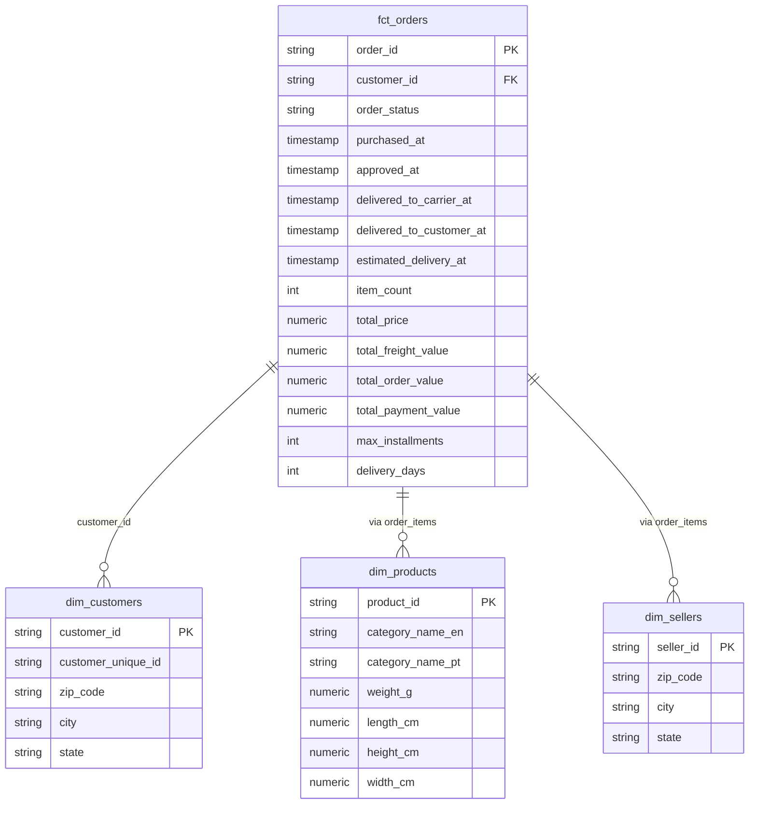
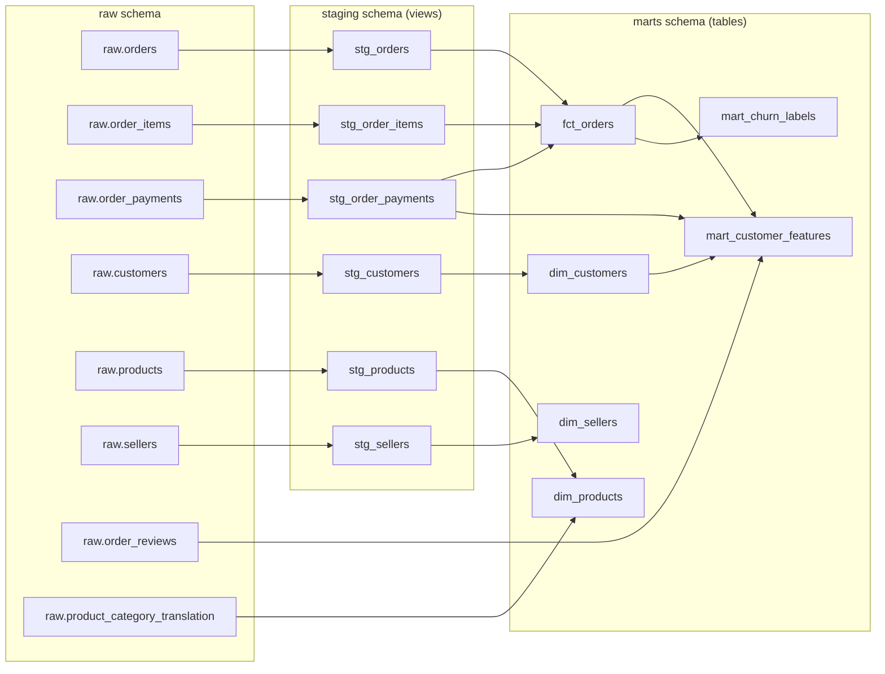

# Data Model — E-commerce Analytics Pipeline

## Tổng quan

Hệ thống sử dụng kiến trúc **3 tầng schema** trong PostgreSQL:

```
raw (9 bảng)  ──▶  staging (6 views)  ──▶  marts (6 tables)
    │                    │                       │
    │                    │                       ├── Star Schema (fact + dim)
    │                    │                       └── ML Feature Store
    │                    │
    │                    └── Chuẩn hoá: rename, cast type
    │
    └── Dữ liệu gốc: dtype text, giữ nguyên từ CSV
```

---

## Star Schema



### Fact Table: `fct_orders`

Bảng trung tâm, mỗi row = 1 đơn hàng, đã aggregate metrics từ `order_items` và `order_payments`:

| Cột | Mô tả | Nguồn |
|---|---|---|
| `order_id` | PK — mã đơn hàng | `stg_orders` |
| `customer_id` | FK → `dim_customers` | `stg_orders` |
| `order_status` | Trạng thái đơn (delivered, shipped, canceled...) | `stg_orders` |
| `purchased_at` | Thời điểm đặt hàng | `stg_orders` |
| `item_count` | Số sản phẩm trong đơn | `COUNT` từ `stg_order_items` |
| `total_price` | Tổng giá sản phẩm (BRL) | `SUM(price)` từ `stg_order_items` |
| `total_freight_value` | Tổng phí vận chuyển | `SUM(freight_value)` từ `stg_order_items` |
| `total_order_value` | Tổng giá trị đơn = price + freight | `SUM(price + freight_value)` |
| `total_payment_value` | Tổng tiền thanh toán thực tế | `SUM(payment_value)` từ `stg_order_payments` |
| `max_installments` | Số kỳ trả góp tối đa | `MAX(payment_installments)` |
| `delivery_days` | Số ngày giao hàng thực tế | `delivered_to_customer_at - purchased_at` |

**Lưu ý quan trọng:**
- `delivery_days = NULL` khi đơn chưa giao → không phải data lỗi
- `total_payment_value` có thể ≠ `total_order_value` do nhiều phương thức thanh toán hoặc voucher
- `order_payments` có thể có nhiều dòng trên 1 đơn → phải `SUM GROUP BY order_id`

### Dimension Tables

| Table | PK | Mô tả |
|---|---|---|
| `dim_customers` | `customer_id` | Thông tin khách hàng: vị trí địa lý (state, city, zip) |
| `dim_products` | `product_id` | Thông tin sản phẩm: category (EN/PT), kích thước, trọng lượng |
| `dim_sellers` | `seller_id` | Thông tin seller: vị trí địa lý |

---

## ML Feature Store (trong marts)

### `mart_customer_features`

Feature engineering cho ML model, mỗi row = 1 khách hàng. Chỉ tính trên đơn hàng `delivered`:

| Feature | Nhóm | Mô tả | Logic |
|---|---|---|---|
| `recency_days` | RFM | Số ngày từ lần mua cuối đến ngày tham chiếu | `ref_date - MAX(purchased_at)` |
| `frequency` | RFM | Số đơn hàng đã đặt | `COUNT(DISTINCT order_id)` |
| `monetary` | RFM | Tổng giá trị mua hàng | `SUM(total_order_value)` |
| `avg_order_value` | RFM | Giá trị trung bình mỗi đơn | `AVG(total_order_value)` |
| `avg_delivery_days` | Delivery | Thời gian giao hàng trung bình | `AVG(delivery_days)` |
| `max_delivery_days` | Delivery | Thời gian giao hàng tệ nhất | `MAX(delivery_days)` |
| `late_delivery_rate` | Delivery | Tỷ lệ đơn giao trễ | `COUNT(late) / COUNT(*)` |
| `avg_items_per_order` | Behavior | Số sản phẩm trung bình mỗi đơn | `AVG(item_count)` |
| `avg_purchase_gap_days` | Behavior | Khoảng cách trung bình giữa các lần mua | `AVG(LAG gap)` |
| `avg_installments` | Payment | Số kỳ trả góp trung bình | `AVG(payment_installments)` |
| `credit_card_rate` | Payment | Tỷ lệ dùng thẻ tín dụng | `COUNT(credit_card) / COUNT(*)` |
| `avg_review_score` | Review | Điểm đánh giá trung bình | `AVG(review_score)` |
| `min_review_score` | Review | Điểm đánh giá thấp nhất | `MIN(review_score)` |
| `bad_review_rate` | Review | Tỷ lệ đánh giá ≤ 2 sao | `COUNT(≤2) / COUNT(*)` |
| `customer_state` | Geo | Bang (27 states Brazil) | Từ `dim_customers` |

### `mart_churn_labels`

Gán nhãn churn cho mỗi khách hàng:

| Cột | Mô tả |
|---|---|
| `customer_id` | PK |
| `last_order_date` | Ngày mua cuối cùng |
| `total_orders` | Tổng số đơn (chỉ delivered) |
| `ref_date` | Ngày tham chiếu = MAX(purchased_at) trong fct_orders |
| `days_since_last_order` | Số ngày kể từ lần mua cuối |
| `is_churned` | `1` nếu `days_since_last_order > 90`, ngược lại `0` |

**Định nghĩa churn:** Khách hàng không có đơn hàng trong **90 ngày** kể từ lần mua cuối tính đến ngày cuối cùng trong dataset.

---

## dbt Lineage (Dependency Graph)



---

## Staging Models — Chi tiết

### `stg_orders`
```sql
-- Source: raw.orders
-- Xử lý: Cast 5 cột timestamp từ text → timestamp
-- Rename: order_purchase_timestamp → purchased_at, etc.
```

| Cột gốc | Cột mới | Type |
|---|---|---|
| `order_id` | `order_id` | text |
| `customer_id` | `customer_id` | text |
| `order_status` | `order_status` | text |
| `order_purchase_timestamp` | `purchased_at` | timestamp |
| `order_approved_at` | `approved_at` | timestamp |
| `order_delivered_carrier_date` | `delivered_to_carrier_at` | timestamp |
| `order_delivered_customer_date` | `delivered_to_customer_at` | timestamp |
| `order_estimated_delivery_date` | `estimated_delivery_at` | timestamp |

### `stg_order_items`
| Cột gốc | Cột mới | Type |
|---|---|---|
| `order_id` | `order_id` | text |
| `order_item_id` | `order_item_id` | text |
| `product_id` | `product_id` | text |
| `seller_id` | `seller_id` | text |
| `shipping_limit_date` | `shipping_limit_at` | timestamp |
| `price` | `price` | numeric(10,2) |
| `freight_value` | `freight_value` | numeric(10,2) |

### `stg_order_payments`
| Cột gốc | Cột mới | Type |
|---|---|---|
| `order_id` | `order_id` | text |
| `payment_sequential` | `payment_sequential` | int |
| `payment_type` | `payment_type` | text |
| `payment_installments` | `payment_installments` | int |
| `payment_value` | `payment_value` | numeric(10,2) |

### `stg_customers`
| Cột gốc | Cột mới | Type |
|---|---|---|
| `customer_id` | `customer_id` | text |
| `customer_unique_id` | `customer_unique_id` | text |
| `customer_zip_code_prefix` | `zip_code` | text |
| `customer_city` | `city` | text |
| `customer_state` | `state` | text |

### `stg_products`
| Cột gốc | Cột mới | Type |
|---|---|---|
| `product_id` | `product_id` | text |
| `product_category_name` | `category_name` | text |
| `product_name_lenght` | `name_length` | int |
| `product_description_lenght` | `description_length` | int |
| `product_photos_qty` | `photos_qty` | int |
| `product_weight_g` | `weight_g` | numeric(10,2) |
| `product_length_cm` | `length_cm` | numeric(10,2) |
| `product_height_cm` | `height_cm` | numeric(10,2) |
| `product_width_cm` | `width_cm` | numeric(10,2) |

### `stg_sellers`
| Cột gốc | Cột mới | Type |
|---|---|---|
| `seller_id` | `seller_id` | text |
| `seller_zip_code_prefix` | `zip_code` | text |
| `seller_city` | `city` | text |
| `seller_state` | `state` | text |

---

## Data Quality Tests

### Tổng quan

16 tests tự động chạy sau mỗi `dbt run`, được định nghĩa trong `schema.yml` của staging và marts:

### Staging Tests (10 tests)

| Model | Column | Test |
|---|---|---|
| `stg_orders` | `order_id` | `unique`, `not_null` |
| `stg_customers` | `customer_id` | `unique`, `not_null` |
| `stg_order_items` | `order_id` | `not_null` |
| `stg_order_items` | `product_id` | `not_null` |
| `stg_order_payments` | `order_id` | `not_null` |
| `stg_order_payments` | `payment_value` | `not_null` |

### Marts Tests (6 tests)

| Model | Column | Test |
|---|---|---|
| `fct_orders` | `order_id` | `unique`, `not_null` |
| `dim_customers` | `customer_id` | `unique`, `not_null` |
| `dim_products` | `product_id` | `unique`, `not_null` |

### Validation ngoài dbt

File `ingestion/validate.py` kiểm tra data quality trên raw schema:

| Check | Query | Mục đích |
|---|---|---|
| `row_counts` | List tables trong `raw` schema | Đảm bảo tất cả 9 bảng đã load |
| `orders_null_check` | Count null trên các cột quan trọng | Phát hiện missing data |
| `orders_duplicate_check` | `GROUP BY HAVING COUNT > 1` | Phát hiện duplicate order_id |
| `geolocation_duplicate_check` | Tương tự cho geolocation | Xác nhận geolocation không có PK tự nhiên |
| `orphan_order_items` | `LEFT JOIN` tìm items không có order | Phát hiện referential integrity vi phạm |

---

## Output — churn_scores

Kết quả scoring ML được lưu vào `marts.churn_scores`:

| Cột | Mô tả |
|---|---|
| `customer_id` | PK |
| `churn_probability` | Xác suất churn (0–1) |
| `predicted_churned` | 0/1 dựa trên best threshold |
| `risk_segment` | Low Risk / Medium Risk / High Risk (percentile bins) |
| `recommended_action` | Đề xuất hành động business |
